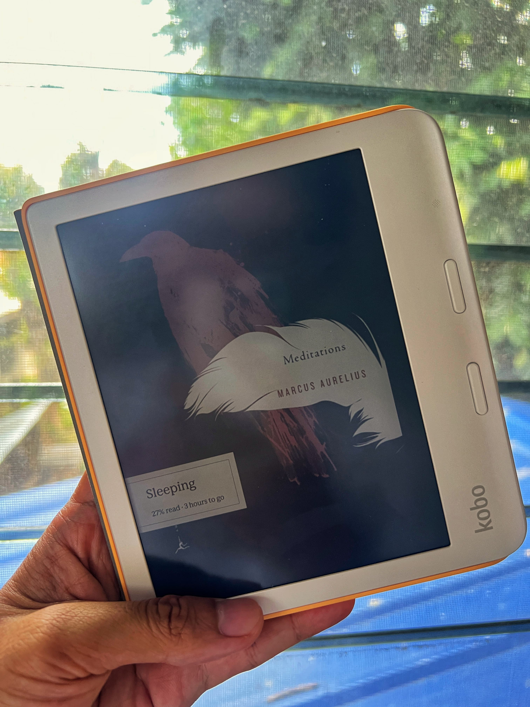

I have read a handful of books related to self-improvement. I feel that most of them follow a pattern: different packaging but the same advice. However, there is one that sits apart from the rest and really sticks with me. It is the **_Meditations_ by Marcus Aurelius**.

If I could recommend one book to someone trying to live a more intentional life, this would be it.

## What It Is

From Wikipedia "https://en.wikipedia.org/wiki/Marcus_Aurelius", **Marcus Aurelius** was a **Roman emperor from 161 to 180** and a **Stoic philosopher**.

He wrote **_Meditations_** not for the public, but as a **private journal**. What makes it powerful is that you are not reading advice meant for an audience, like most self-help books today, you are reading **someone's advice to themselves**.

## Why It Still Matters

Even though it is already nearly 2,000 years old, the problems that Marcus experienced are the same ones we face today:

- Distraction
- Not being present
- Frustration with other people
- Anxiety about things outside our control (past and present)
- The temptation to waste time on things that don't matter

His approach is grounded in **Stoic philosophy**, which boils down to a simple idea: **Focus only on what you can control, your thoughts, your actions, your character. Everything else is just noise.**

## Some of My Favorite Lines From Him

> “When you wake up in the morning, tell yourself: the people I deal with today will be meddling, ungrateful, arrogant, dishonest, jealous and surly. They are like this because they can't tell good from evil. But I have seen the beauty of good, and the ugliness of evil, and have recognized that the wrongdoer has a nature related to my own - not of the same blood and birth, but the same mind, and possessing a share of the divine. And so none of them can hurt me. No one can implicate me in ugliness. Nor can I feel angry at my relative, or hate him. We were born to work together like feet, hands and eyes, like the two rows of teeth, upper and lower. To obstruct each other is unnatural. To feel anger at someone, to turn your back on him: these are unnatural.”

I think this is one of the most powerful quotes in the book. It reminds us that the world is full of ungrateful, arrogant, and dishonest people. Some will take advantage of us, and some simply do not know right from wrong. But we should not be upset because this is how the world works. They act this way **not out of malice, but out of ignorance**. Since I know the difference between right and wrong, I choose not to hold anger or negativity toward them. I will stay open-minded and objective while dealing with them. And regardless of what they do, **they cannot take away my highest faculty, my ability to think and choose clearly**. This is the most powerful thing I learned from Marcus Aurelius.

> "Think of yourself as dead. You have lived your life. Now take what's left and live it properly."

This resonates with me because I often waste time worrying about the past and thinking about other people's opinions. It is easy to replay old mistakes or wonder how others judge us. But this quote cuts through all of that. **If I think of my past life as already finished, then all that matters is how I choose to live from this moment forward, with clarity and intention.**

> "When you arise in the morning, think of what a precious privilege it is to be alive, to breathe, to think, to enjoy, to love."

This is a strong reminder for me to cherish every moment. Many of us wake up and immediately think about work, problems, or responsibilities. Marcus reminds us to pause and recognize something simple but powerful, **being alive is already a privilege.** Every morning is another chance to experience life, to think clearly, to appreciate small moments, and to be with the people we love.

> "Accept whatever comes to you, woven in the pattern of your destiny. For what could more aptly fit your needs?"

This relates to **Amor Fati**, which means **loving one's fate**. It is the idea of not only accepting what happens in life, but embracing it fully. Everything that happens, whether good or difficult, becomes part of the path we are meant to walk.

For me, this means trusting that events in life serve a purpose, even when I do not immediately understand them. **Challenges and setbacks are not obstacles, they are part of becoming stronger and wiser.**

## How to Read It

I do not think **_Meditations_** is a book you need to read cover to cover in one sitting. I usually read it early in the morning during my coffee time, or at random moments during the day when I want to pause and reflect.

## Final Thought

So if you have a chance to grab **_Meditations_**, please check it out. Hopefully it helps you as much as it helped me. ✌️
