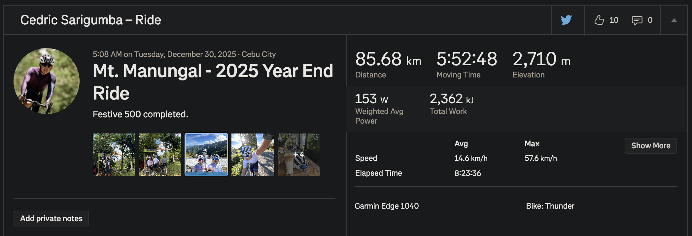

Last December, I completed the **500km Rapha Challenge**. For those who don't know, the challenge runs from December 25 to December 31, seven days, right in the middle of Christmas and New Year. That timing is part of what makes it hard. Everyone around you is resting, eating too much, celebrating. It's the one week of the year where nobody expects you to be disciplined, and almost no one is. The festive atmosphere is everywhere, and the social pressure to just relax and enjoy it is real. That's exactly what makes showing up on the bike every single day during that week so difficult.

_500km done. December 25 to 31._

It wasn't easy. There were moments during the long rides where I genuinely wanted to quit, where my legs were done and my mind was looking for any excuse to stop. But I kept going, and somewhere in those final kilometers, something shifted. It wasn't just about finishing the challenge anymore. It was about what it means to keep going when everything around you is telling you to stop.

And here's what I've come to believe: where you grew up doesn't matter. What setbacks you've had before don't matter. **The only thing that matters is what you choose to do right now.** I know that sounds like something you'd find on a motivational poster, but I really mean it. Most people are too busy worrying about what other people think to actually do the hard thing. Here's the truth: the people who are judging you are the same people who aren't willing to do what you're doing. Finishing 500 kilometers during Christmas week isn't something most people will ever do, not because they can't, but because they won't start, and if they start, they won't keep going when it gets uncomfortable.

But I think the problem goes deeper than just willpower. That endless feed you scroll through every morning before you even get out of bed is not just a habit. It's designed by smart people to keep you coming back, keep you hooked, and keep the money flowing to the platforms. The side effect is that your brain starts expecting fast rewards. And when something requires sustained effort over days or weeks, like a cycling challenge, it starts to feel impossibly hard, not because it is, but because you've been conditioned to give up the moment a reward isn't immediate. Your habits are being shaped, and most of the time, _you don't even notice it's happening._

The reason this is so hard to see is because it happens slowly, in small steps, over a long time. By the time it's worked, you'll feel like you're just making free choices, but those choices are being made inside a system designed to nudge you in a certain direction. I've sat on the couch with my family, a movie on, and still reached for my phone. Not because anything important was happening. Just because the pull was there. The goal of these apps is not to enrich your life. It's to keep you scrolling so you produce, consume, and comply.

The people who benefit most from this system are the ones who want you distracted, dependent, and comfortable. But they cannot control your mind completely. You still have the freedom to think for yourself. Recognizing that you've been conditioned is the first step. Deciding to do something about it is the second.

I also think real confidence only comes from self-control. Not from escapes that numb you, but from doing the things that are actually hard. Finishing the Rapha 500km during Christmas week, when everyone else was resting, reminded me of that. Your actions either build you up or they don't. There's no shortcut around it.

If you ride too, let's connect on [Strava](https://www.strava.com/athletes/75785503). ✌️
