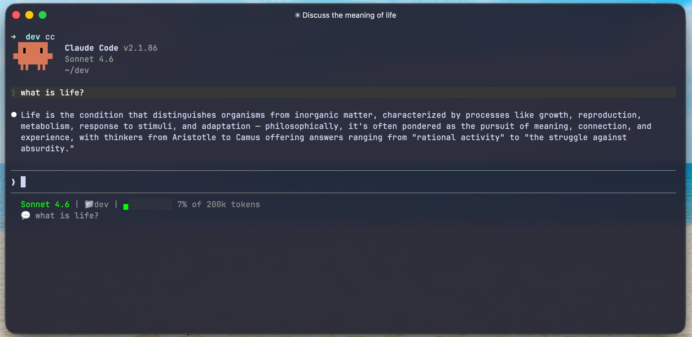

I switched from iTerm2 to [Ghostty](https://ghostty.org/) a month ago and I'm not going back. For those who haven't heard of it, Ghostty is a relatively new terminal emulator built from scratch in Zig with GPU-accelerated rendering. I first noticed the difference during a long Claude Code session, iTerm2 was lagging as output streamed in, and I figured there had to be something faster. This post is a practical walkthrough of why I switched and my full config, so you can try it yourself.


_My current Ghostty setup running Claude Code._

## Why Ghostty

The main reason is speed. Ghostty uses your GPU to render text instead of the CPU, and you can feel the difference. During Claude Code sessions where output is streaming fast and non-stop, Ghostty stays smooth. iTerm2 would lag and stutter during the same workload. It also starts up almost instantly and uses less memory, it just feels lighter overall.

Out of the box, Ghostty comes with Nerd Font support and hundreds of built-in themes, so you don't have to configure much to get a good setup. And when you do want to customize, it's a single plain text config file at `~/.config/ghostty/config`. No settings GUI, no menus to dig through. You edit the file, hit `Cmd+,` to reload, and you're done.

## My Config

Here's my full Ghostty config. I'll walk through each section so you know what it does and why I set it that way.

### Typography

```
font-family = JetBrainsMonoNerdFont
font-size = 14
font-thicken = true
adjust-cell-height = 2
```

JetBrains Mono is my go-to monospace font. The Nerd Font variant gives me all the icons I need for file trees and terminal tools. `font-thicken` makes the text a bit bolder on Retina displays, and `adjust-cell-height = 2` adds a little breathing room between lines so long sessions are easier on the eyes.

### Theme

```
theme = catppuccin-mocha
```

I use Catppuccin Mocha, a dark theme with soft, pastel colors that's easy to look at for hours. Ghostty also supports auto light/dark switching with `theme = light:Catppuccin Latte,dark:Catppuccin Mocha` if you prefer that, but I just keep it dark.

### Window

```
background-opacity = 0.92
background-blur-radius = 20
window-padding-x = 10
window-padding-y = 8
window-save-state = always
window-theme = auto
minimum-contrast = 1.3
macos-titlebar-style = tabs
```

A slight transparency with blur gives the terminal a clean, modern look without being distracting. `window-save-state = always` means Ghostty remembers my window positions and tabs between sessions, so I pick up right where I left off. `macos-titlebar-style = tabs` keeps things compact by putting tabs in the title bar instead of taking up extra space.

### Cursor and Mouse

```
cursor-style = bar
cursor-style-blink = true
cursor-opacity = 0.8
mouse-hide-while-typing = true
copy-on-select = clipboard
```

Bar cursor because I find it cleaner than a block. `copy-on-select = clipboard` is a small thing but saves a lot of `Cmd+C` presses, just highlight text and it's copied.

### Notifications and Security

```
desktop-notifications = true
clipboard-paste-protection = true
clipboard-paste-bracketed-safe = true
shell-integration = detect
scrollback-limit = 25000000
```

Desktop notifications are handy when a long-running command finishes. Clipboard paste protection warns you before pasting something suspicious into the terminal, which is a nice safety net. The big one here is `scrollback-limit = 25000000`, I set this high specifically for Claude Code sessions, where the output can get very long and I want to be able to scroll back through everything.

### Splits

```
keybind = cmd+d=new_split:right
keybind = cmd+shift+d=new_split:down
keybind = cmd+w=close_surface
```

If you want to have a new surface without opening a separate window, Ghostty supports splitting. `Cmd+D` splits to the right, `Cmd+Shift+D` splits down, and `Cmd+W` closes the current split.

### Tabs and Utilities

```
keybind = cmd+t=new_tab
keybind = cmd+shift+left=previous_tab
keybind = cmd+shift+right=next_tab
keybind = cmd+plus=increase_font_size:1
keybind = cmd+minus=decrease_font_size:1
keybind = cmd+zero=reset_font_size
keybind = cmd+comma=reload_config
```

Standard tab and font size shortcuts. `Cmd+,` to reload the config is one I use constantly while tweaking settings.

## The Quick Terminal

One of my favorite features is the quick terminal, a dropdown terminal that slides in from the top of your screen with a single hotkey.

```
quick-terminal-position = top
quick-terminal-screen = mouse
quick-terminal-autohide = true
quick-terminal-animation-duration = 0.15
keybind = global:ctrl+grave_accent=toggle_quick_terminal
```

I press `Ctrl+backtick` from anywhere on my Mac and a terminal drops down from the top of the screen. The animation is set to 0.15 seconds so it feels instant. I use it constantly for quick git commands, checking a file, or running a one-liner without switching away from whatever I'm working on. It's like having a scratch terminal always one keystroke away.

## One Gripe

It's not perfect. I've noticed that after long sessions, the keyboard shortcuts sometimes stop working properly. It doesn't happen often, but when it does, the fix is just opening a new terminal window. Minor, but worth mentioning.

## One Month In

I've been using Ghostty for about a month now and I don't see myself going back to iTerm2. It's fast, lightweight, and the config is dead simple. If you spend a lot of time in the terminal, especially if you're running Claude Code, give it a try. You can grab it at [ghostty.org](https://ghostty.org/) and drop the config below into `~/.config/ghostty/config` to get started. ✌️

## Full Config

Here's the complete config in one block so you can copy and paste it directly:

```
# Typography

font-family = JetBrainsMonoNerdFont
font-size = 14
font-thicken = true
adjust-cell-height = 2

# Theme

theme = catppuccin-mocha

# Window

background-opacity = 0.92
background-blur-radius = 20
window-padding-x = 10
window-padding-y = 8
window-save-state = always
window-theme = auto
minimum-contrast = 1.3
macos-titlebar-style = tabs

# Cursor & Mouse

cursor-style = bar
cursor-style-blink = true
cursor-opacity = 0.8
mouse-hide-while-typing = true
copy-on-select = clipboard

# Quick Terminal

quick-terminal-position = top
quick-terminal-screen = mouse
quick-terminal-autohide = true
quick-terminal-animation-duration = 0.15
keybind = global:ctrl+grave_accent=toggle_quick_terminal

# Notifications & Security

desktop-notifications = true
clipboard-paste-protection = true
clipboard-paste-bracketed-safe = true
shell-integration = detect
scrollback-limit = 25000000

# Splits
keybind = cmd+d=new_split:right
keybind = cmd+shift+d=new_split:down
keybind = cmd+w=close_surface

# Tabs

keybind = cmd+t=new_tab
keybind = cmd+shift+left=previous_tab
keybind = cmd+shift+right=next_tab

# Font Size

keybind = cmd+plus=increase_font_size:1
keybind = cmd+minus=decrease_font_size:1
keybind = cmd+zero=reset_font_size

# Utilities
keybind = cmd+comma=reload_config
```
