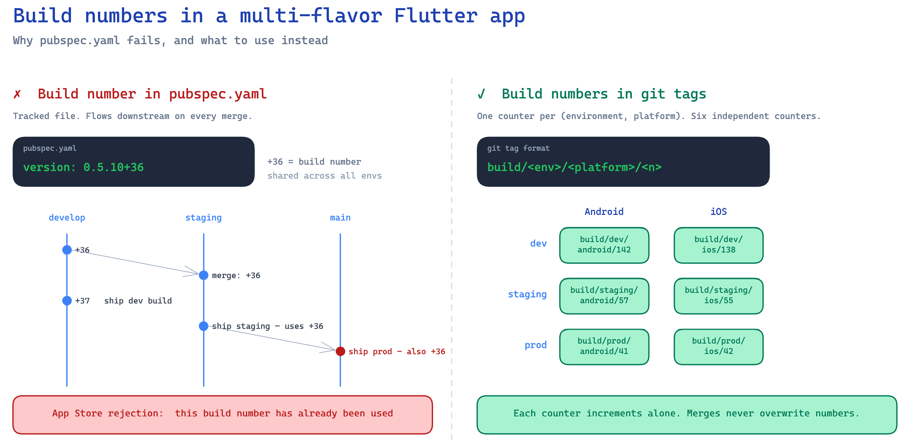

If you ship a Flutter app with separate dev, staging, and production environments, each with its own package name in the Play Store and its own bundle ID in the App Store, you have three apps to keep alive, not one. And every one of them needs a build number that strictly increases. Miss that, and the store rejects the upload with "this build number has already been used."

Sounds easy. It isn't.

The default place to put the build number is `pubspec.yaml`, in the `version: 0.5.10+36` line, where `+36` is the integer Android and iOS use to dedupe uploads. The trouble is that `pubspec.yaml` is a tracked file. It flows downstream every time you promote `develop` into `staging`, or `staging` into `main`. So every environment overwrites the others, and the numbers stop being monotonic the second you ship from more than one branch.

We hit this on a real app. This post is about the fix we landed on: pulling the build number out of `pubspec.yaml` entirely, and into git tags, one counter per (environment, platform) pair.

To illustrate the problem, consider the following image below.



## Why pubspec.yaml stops working

Picture this. Friday afternoon, you bump the build number on `develop`, run a dev build, commit `+37`. Monday morning, you cut a staging build from the latest promotion PR. Staging was at `+34` before. Now it's at `+37`, because `pubspec.yaml` came along for the ride. The two staging builds you cut last sprint at `+35` and `+36` are skipped over entirely, and you have no idea anymore what number staging is supposed to be at.

Then the same thing happens one layer up. Staging at `+37` promotes into `main`. Production, which was sitting at `+22`, jumps to `+37` overnight even though no production build happened.

The numbers stop being monotonic per environment. Sometimes they skip. Sometimes they collide with something the store has already seen, and the upload bounces.

The root cause is that the build number lives in a file that flows downhill through merges. The build number's job is to be a strictly increasing counter per app. A tracked file in a branch-merge graph cannot do that job.

## The Fix: One Counter Per (Environment, Platform)

Six counters total, one per cell:

|     | Android | iOS     |
| --- | ------- | ------- |
| dev | counter | counter |
| stg | counter | counter |
| prd | counter | counter |

Three environments is obvious. Why split by platform too? Because the Play Console and App Store Connect don't talk to each other. Android tracks `versionCode`, iOS tracks `CFBundleVersion`, and a number in one console means nothing in the other.

Sharing one counter across platforms sounds tidy but breaks the first time they drift. iOS fails code-signing, Android already pushed, and now your "shared" counter has a gap nobody can explain. What actually ties an Android build to its iOS twin is the version name plus the commit SHA. The build number doesn't need to do that job. Let each app have its own counter.

Each counter lives in git tags with a format like:

```
dev-android/0.5.11+37
dev-ios/0.5.11+12
stg-android/0.5.11+9
stg-ios/0.5.11+8
prd-android/0.5.11+3
prd-ios/0.5.11+3
```

Three reasons tags are the right home for this counter:

1. **They don't flow through merges.** A tag is a pointer to a commit. It doesn't exist on any branch. Promoting `develop` into `staging` doesn't carry tags along, so each environment's counter is genuinely isolated.
2. **Creating one isn't a file edit.** No merge conflict, no extra commit on the branch. Just `git tag` and `git push`.
3. **They're append-only and orderable.** `git tag --list 'dev-android/*' | sort -V | tail -n 1` gives you the current state of the counter, every time, without reading any file.

The `+N` in `pubspec.yaml` becomes decorative. The line stays because Flutter still parses `pubspec.yaml` to read the version name, but the integer after the `+` is ignored at build time. The version name `x.y.z` is still where it should be, edited by hand once per release cycle. The build number is now owned by git, not by `pubspec.yaml`.

## The Script and the Makefile

One shell script does all the work. Given an environment and a platform, it looks up the latest tag, increments by one, runs `flutter build` with the new number, then creates and pushes the tag.

```bash
#!/usr/bin/env bash
# scripts/build_with_tag.sh <env> <platform>
set -euo pipefail

env="$1"
platform="$2"

# Read the version name (x.y.z) from pubspec.yaml; ignore the +N.
version_name=$(grep '^version:' pubspec.yaml \
  | sed -E 's/version: *([0-9]+\.[0-9]+\.[0-9]+).*/\1/')

# Find the latest tag for this (env, platform).
prefix="${env}-${platform}/"
latest_tag=$(git tag --list "${prefix}*" | sort -V | tail -n 1)

if [ -z "$latest_tag" ]; then
  echo "No tags for ${prefix}. Run the seeding step first." >&2
  exit 1
fi

latest_num=$(echo "$latest_tag" | sed -E 's/.*\+([0-9]+)$/\1/')
next_num=$((latest_num + 1))

if [ "$platform" = "android" ]; then
  flutter build appbundle --flavor "$env" --build-number="$next_num"
else
  flutter build ipa --flavor "$env" --build-number="$next_num"
fi

new_tag="${prefix}${version_name}+${next_num}"
git tag -a "$new_tag" -m "Build ${new_tag}"
git push origin "$new_tag"
```

The Makefile is six one-liners that pass the right pair of arguments:

```makefile
build-android-dev:
	./scripts/build_with_tag.sh dev android

build-android-stg:
	./scripts/build_with_tag.sh stg android

build-android-prd:
	./scripts/build_with_tag.sh prd android

build-ios-dev:
	./scripts/build_with_tag.sh dev ios

build-ios-stg:
	./scripts/build_with_tag.sh stg ios

build-ios-prd:
	./scripts/build_with_tag.sh prd ios
```

For whoever pushes the build button, nothing changes from before. They still run one `make` command per build. The script handles tag lookup, the increment, the build, the tag write, and the push.

One caveat. The script reads the latest tag before it builds, so two people running the same target at the same time can pick the same next number and race on the push. We haven't hit this in practice (builds take minutes, and only one person cuts a release at a time), but if you parallelize this in CI, add a lock.

## A Reading Command for the New Source of Truth

When the build number lived in `pubspec.yaml`, anyone could check it with `cat pubspec.yaml`. The new design needs the equivalent. Without one, "what is the current build number for staging iOS?" turns into "open App Store Connect, then the Play Console, then look at the right environment and platform for all six combinations." That's exactly the kind of opacity that makes a team resist a change even when the change is correct.

So the same Makefile gets a `tags-latest` target:

```makefile
tags-latest:
	@for env in dev stg prd; do \
	  for platform in android ios; do \
	    tag=$$(git tag --list "$$env-$$platform/*" | sort -V | tail -n 1); \
	    echo "$$env-$$platform: $${tag:-<none>}"; \
	  done; \
	done
```

Running `make tags-latest` prints the current number for all six counters in one shot. That is the read-path that replaces `cat pubspec.yaml`. New write-paths almost always need new read-paths. Build one, you owe yourself the other.

## Seeding: The One-Time Migration

The script assumes there is already a tag to read. If the `<env>-<platform>` prefix has no tags, it bails out. That is by design, because the first time you switch to this system, you almost never want to start counting from one.

Your stores already have live builds. Maybe dev-android is at `+36`, dev-ios at `+12`, prd-android at `+3`, and so on. If the script counted from one, the very next upload would be rejected immediately.

So before the first tag-driven build, record each existing store-deployed number as a seed tag:

```bash
git tag -a dev-android/0.5.10+36 <commit> -m "Seed: dev-android at +36"
git tag -a dev-ios/0.5.10+12     <commit> -m "Seed: dev-ios at +12"
git tag -a stg-android/0.5.10+18 <commit> -m "Seed: stg-android at +18"
git tag -a stg-ios/0.5.10+15     <commit> -m "Seed: stg-ios at +15"
git tag -a prd-android/0.5.10+3  <commit> -m "Seed: prd-android at +3"
git tag -a prd-ios/0.5.10+3      <commit> -m "Seed: prd-ios at +3"

git push origin --tags
```

A git tag has to point at a commit, so pick any commit that already shipped to the stores. The SHA itself does not matter for the counter logic; only the trailing number does. After the push, every build increments from these seeds and you never collide with the stores again.

## Wrapping Up

If a value has to be strictly monotonic and your git flow keeps overwriting it, the fix isn't stricter editing discipline. Move the value out of the file and into something that doesn't get merged. Git tags work, and they cost nothing to adopt.

Set this up on day one of a multi-environment Flutter project, before the first store rejection. Hopefully it saves you the headache. ✌️
