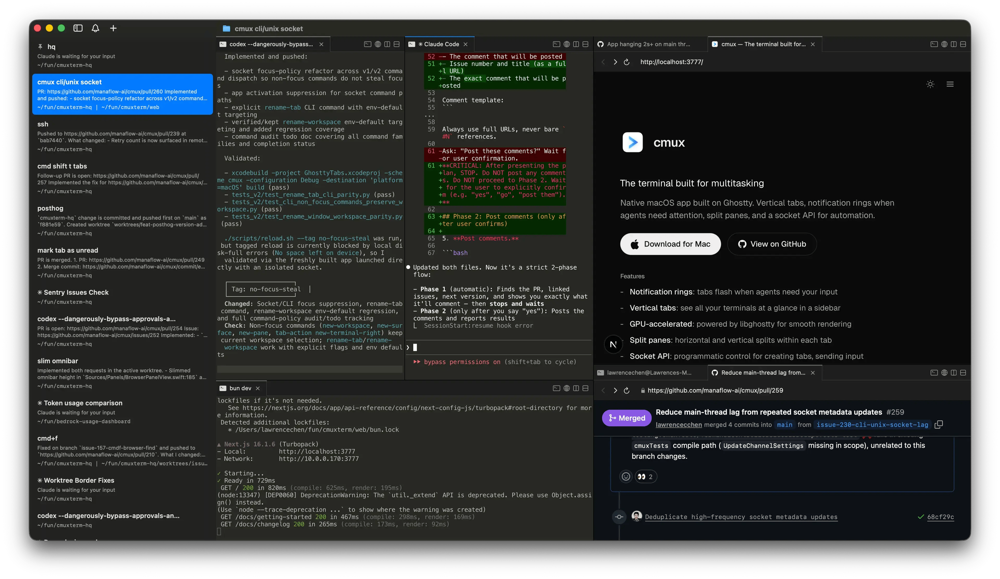

A few months ago I wrote about switching to [Ghostty](/posts/why-i-use-ghostty-as-my-terminal-on-macos) and how I wasn't going back to iTerm2. I meant it. Ghostty is fast, light, and the config is dead simple. What changed isn't Ghostty, it's how I work. I went from running one Claude Code session at a time to running several, and a single terminal window stopped being enough. That's how I ended up on [cmux](https://cmux.com/), and it's now my main terminal.

The bigger shift behind all of this is AI. Software development today leans on it so heavily that I barely open an IDE anymore. Most of my day happens in the terminal now, with agents doing the typing while I steer. Once the terminal becomes where you actually live, the terminal you pick starts to matter a lot more.

_cmux's vertical tabs and split panes. Screenshot from the official [cmux](https://cmux.com/) site._

## It's built on Ghostty

The first thing that made this easy: cmux isn't a competitor to Ghostty, it's built on top of it. It uses libghostty, the same rendering engine, as a library. Think of it like an app using WebKit for web views. So the GPU-accelerated speed I liked about Ghostty carries straight over, and so does my config. cmux reads terminal keybindings from the same `~/.config/ghostty/config` file I already had, so the whole setup from my last post still works without touching anything.

That's the part that sold me. I didn't have to give up the thing I liked to get the thing I needed.

## The real reason: multiple agents

Here's the problem cmux solves for me. When you run two or three Claude Code agents in parallel, a normal terminal turns into a mess of windows. You lose track of which one is working, which one finished, and which one is sitting there waiting for you to answer a question. I was alt-tabbing constantly and still missing things.

cmux is built for exactly this. My setup is simple: one workspace per project, one tab per Claude Code agent session. The tabs run vertically down the side, and each one shows its git branch, the working directory, and a little notification text. I can glance at the sidebar and immediately see the state of every agent I have running.

When I'm working on something bigger, I pair this with git worktrees. Each agent gets its own worktree of the repo, so they can all work the same project at the same time without stepping on each other. One tab, one worktree, one agent. It stays organized no matter how many I spin up.

## Notifications do the babysitting

The feature I didn't know I wanted is the notification rings. When an agent needs my attention, finishes a task or stops to ask something, its pane lights up with a ring, the sidebar gets a badge, and I get a macOS notification. These fire automatically through standard terminal escape sequences, so Claude Code triggers them without any special setup.

This changed how I work more than I expected. Instead of hovering over each session waiting for it to do something, I let them all run and only jump in when one actually pings me. The terminal tells me where to look. For parallel agent work, that's the whole game.

## The browser split

Each tab can also split a browser pane next to the terminal. So I'll have Claude on one side and, on the other, the PR it's working on, or localhost, or whatever docs I need. This is especially handy for UI work. When Claude is building or tweaking a frontend, I keep the running app open in the browser split right next to it, so I see the change the moment it lands instead of bouncing to another window to check. I switch tasks by switching tabs, and each task carries its own little world with it, the agent and the browser together. I used to keep all of that in separate Chrome windows and lose track of which tab belonged to which task. Now it lives with the work.

## Getting started

Setup is about as easy as Ghostty was. You [download it for Mac](https://cmux.com/download/confirmation?dl=1), and if you already use Ghostty, your config comes along for free. The cmux-specific shortcuts for workspaces, splits, and the browser live in Settings, and everything terminal-level still reads from your Ghostty config. One practical note: cmux is macOS only for now, since it's a native Swift app. If you're on Linux or Windows, this one isn't for you yet.

## Where I landed

I'm not abandoning Ghostty so much as I grew into the thing built on top of it. If you run one terminal session at a time, Ghostty is still great and you probably don't need this. But the moment you start running multiple coding agents at once, a plain terminal starts working against you, and cmux is the first thing I've used that's actually designed for that workflow. It's free and open source, so it's an easy one to try. Grab it at [cmux.com](https://cmux.com/) and point it at your existing Ghostty config to get going. ✌️
