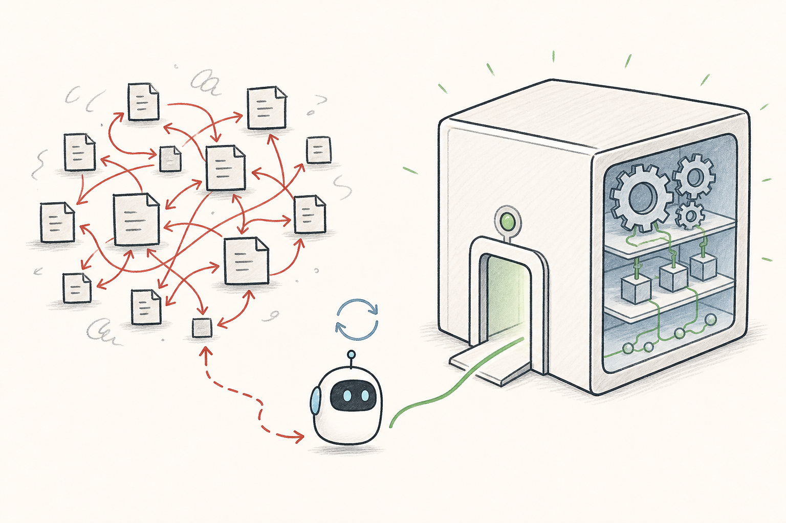

I spawn a lot of AI coding agents. Some finish with barely any guidance. Others get lost, change the wrong thing, or return code that works only after I patch it together.

I used to blame the prompt. I would rewrite the instructions, add context, and try again. But an agent can receive a detailed task and still struggle if the codebase is difficult to navigate.

Every agent enters the codebase like a new hire whose onboarding resets each morning. It has the skills, but none of yesterday's context.

The codebase itself is the real prompt.



## Starting From Zero

That new starter creates three costs.

First, the feedback loop is slow. The agent reads files and traces dependencies before it can make a useful change. Slow tests stretch that loop further.

Second, navigation is hard. What looks like a clear architecture to me may look like hundreds of equally important files to an agent. It cannot tell which path is current and which code is outdated.

Third, I become the integration layer. I fix imports, move logic, and patch missed edge cases. Do that often enough and the productivity gain starts to look suspiciously like extra work.

## What the Agent Sees

When I look at a familiar system, I know which services matter, which abstractions are accidental, and which code is safe to change. An agent sees a flat collection of files and relationships. It has to discover the architecture each time.

That gets expensive when a capability is spread across shallow, interconnected pieces:

```text
auth/
  PasswordHasher.java
  TokenGenerator.java
  SessionRepository.java
user/
  UserRepository.java
  UserService.java
web/
  LoginController.java
```

The folders look clean, but the controller may call every class directly. To understand login, the agent has to trace the whole web. Humans pay the same cost, we just carry context between tasks.

## A Smaller Surface Area

The alternative is a deep module: a small public interface hiding a substantial implementation. The idea comes from John Ousterhout's [_A Philosophy of Software Design_](https://web.stanford.edu/~ouster/cgi-bin/book.php). A deep module provides useful behavior through a simple interface. A shallow one exposes almost as much complexity as it hides.

Instead of hundreds of pieces that all know about one another, the system becomes a few substantial capabilities. Seven or eight is not a rule, but it is a better direction than seven or eight hundred places to start.

```text
auth/
  AuthService.java          <- public boundary
  AuthServiceImpl.java      <- package-private
  PasswordHasher.java       <- package-private
  CredentialStore.java      <- package-private
  TokenGenerator.java       <- package-private
  AuthServiceTest.java      <- locks down behavior
```

An agent can read `AuthService` and understand the module without opening its internals. It only goes deeper when the task requires it. That is progressive disclosure in code: start with the capability, reveal the plumbing only when it matters.

## A Grey Box

I think of this as a grey box. A black box asks me to trust code I cannot inspect. A white box asks me to understand every detail. A grey box gives me a boundary I own and internals I can inspect when needed.

I own the public interface, the module boundary, and the tests. The agent can refactor the hashing flow, replace token generation, or reorganize storage inside that boundary. If the contract stays stable and the tests pass, the change is easier to review.

This maps to how I think about being [in the loop or on the loop](/posts/in-the-loop-or-on-the-loop), especially human on the loop (HOTL), and to the Maker-Checker pattern. I am the checker at the boundary: I decide what the module promises and verify the result. The agent is the maker inside it.

I stay in the loop for the interface. I can move on the loop for more of the implementation because the blast radius is controlled.

## A Spring Boot Example

For authentication, the public boundary can stay small:

```java
package com.example.auth;

import java.util.Optional;

public interface AuthService {
    void signUp(String email, String password);
    Optional<String> logIn(String email, String password);
}
```

The rest of the application depends only on `AuthService`. Its implementation and collaborators share the same package and remain package-private:

```java
package com.example.auth;

import java.util.Optional;
import org.springframework.stereotype.Service;

@Service
class AuthServiceImpl implements AuthService {
    private final PasswordHasher passwords;
    private final CredentialStore credentials;
    private final TokenGenerator tokens;

    AuthServiceImpl(PasswordHasher passwords,
                    CredentialStore credentials,
                    TokenGenerator tokens) {
        this.passwords = passwords;
        this.credentials = credentials;
        this.tokens = tokens;
    }

    @Override
    public void signUp(String email, String password) {
        credentials.save(email, passwords.hash(password));
    }

    @Override
    public Optional<String> logIn(String email, String password) {
        return credentials.findPasswordHash(email)
            .filter(hash -> passwords.matches(password, hash))
            .map(ignored -> tokens.create(email));
    }
}
```

The collaborators are ordinary package-private Spring beans. Here is a small in-memory implementation:

```java
package com.example.auth;

import java.util.Map;
import java.util.Optional;
import java.util.UUID;
import java.util.concurrent.ConcurrentHashMap;
import org.springframework.security.crypto.factory.PasswordEncoderFactories;
import org.springframework.security.crypto.password.PasswordEncoder;
import org.springframework.stereotype.Component;

@Component
class PasswordHasher {
    private final PasswordEncoder encoder = PasswordEncoderFactories
        .createDelegatingPasswordEncoder();

    String hash(String raw) { return encoder.encode(raw); }

    boolean matches(String raw, String encoded) {
        return encoder.matches(raw, encoded);
    }
}

@Component
class CredentialStore {
    private final Map<String, String> passwordHashes = new ConcurrentHashMap<>();

    void save(String email, String hash) {
        passwordHashes.put(email, hash);
    }

    Optional<String> findPasswordHash(String email) {
        return Optional.ofNullable(passwordHashes.get(email));
    }
}

@Component
class TokenGenerator {
    String create(String email) { return UUID.randomUUID().toString(); }
}
```

In a real application, the store would use a database and the token generator would create signed, expiring tokens. Those choices stay inside the module. Code outside the package gets one way in.

I would keep these types in `com.example.auth`. Java subpackages are separate packages, so moving them to `com.example.auth.internal` would require public types or another way to enforce the boundary.

Tests define the behavior that the interface cannot:

```java
@SpringBootTest
class AuthServiceTest {
    @Autowired
    AuthService auth;

    @Test
    void returnsTokenForValidCredentials() {
        auth.signUp("me@example.com", "correct-password");

        assertTrue(auth.logIn("me@example.com", "correct-password").isPresent());
    }

    @Test
    void rejectsInvalidPassword() {
        auth.signUp("me@example.com", "correct-password");

        assertTrue(auth.logIn("me@example.com", "wrong-password").isEmpty());
    }
}
```

Fast tests let the agent verify its work without making me reconstruct the implementation. They keep the grey box honest. If feedback takes twenty minutes, the agent can make several bad decisions before learning that the first one was wrong.

## None of This Is New

Deep modules do not remove engineering judgment. Someone still decides what belongs together, what the interface promises, and which behaviors need tests. A giant service with fifty methods is not deep, it is just large. The goal is fewer concepts for the rest of the system to understand.

Clear boundaries, encapsulation, stable interfaces, and fast tests have helped humans for decades. What works for a new engineer also works for an agent: show them where to start, limit what they need to understand, and give them quick feedback.

Better prompts still help. But when I repeatedly explain the same architecture to an agent, I now wonder whether that context belongs in the codebase.

I am designing for the next person who has to read the code. That person just happens to show up twenty times a day now.
